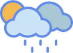

# Project Weather App

  <h3>Weatherly</h3>
  

Live: [Weatherly](https://abdullahhatim.github.io/Project-Weather-App-TOP/)  
`(Project completed in 16 hours across 3 days)`

A weather application that displays current weather conditions and forecasts. The app features:

- 🌎 Location-based weather data
- ⛅ Visual weather icons for different conditions
- 😊 Each weather condition has unique personality
- 📱 Fully responsive design

<small>**API KEYS ARE NOT TO BE PUT ON THE FRONT-END BUT THIS IS JUST A PET PROJECT**</small>

## Known Bugs

- switching from Fahrenheit to Celsius then changing day will show inconsistent results
